# SAMPLE DELIVERY 02｜シナプス・リレーションマップ

**CLIENT：八田英子さま**  
**CENTRAL QUESTION：散らばって見える活動は、何を中心につながっているのか**  
**SAMPLE STATUS：商品見本**

> 出生情報は受け取りましたが、この商品は現在の言葉と活動を整理するものなので、占星術的な推測には使用していません。相談に不要な個人情報を、成果物へ無理に入れないこともサービス設計の一部です。

---

## RELATIONSHIP MAP

```mermaid
flowchart TB
    E["八田英子<br/>LIFE / DIRECTION"]

    L["LIFEの現場<br/>コハク・動物・森・母・馬"]
    H["hachico<br/>Lifeから世界を見る"]
    K["知識の海<br/>科学・哲学・民俗・歴史・経済・芸術"]
    EC["ECHO<br/>世界からLifeを見る"]
    HO["HOLOS 88<br/>Museum of Relationships"]
    S["SATORI<br/>意味・生態・もう一枚の窓"]
    C["CHATO<br/>調査・構造・実装・運営"]
    B["心白<br/>価値を小さく届ける実験店"]
    I["基盤<br/>Web・Google Workspace・SNS・Ko-fi"]
    W["読者／購入者<br/>自分のLifeへ戻る人"]

    L --> H
    H --> HO
    K --> EC
    EC --> HO
    S --> HO
    C --> HO
    C --> B
    I --> HO
    I --> B
    HO --> W
    B --> W
    W -. "反応・対価・新しい問い" .-> E
    B -. "実験で得た知見だけ" .-> HO
    E --> L
    E --> K
    E --> B
```

## 中心にあるもの

中心は「多くのことに興味がある人」ではありません。

八田英子さんの活動は、いつもLifeから始まっています。

雨、犬、猫、馬、母の編み物、台所、夕焼け。その小さな場面から、気候、政治、哲学、AI、歴史へ飛ぶ。そして知識を集めたまま終わらず、もう一度、食卓や身体や今日の選択へ戻ろうとする。

したがって中心にあるのは、ジャンルではなく、次の往復です。

> **Lifeから世界へ。世界からLifeへ。**

HOLOS 88は、この往復を収蔵するMuseumです。

## 五つの関係

### 1｜コハク、動物、森、母、馬は「私生活」ではない

これらは記事の飾りではなく、世界を見る観測地点です。

動物から福祉、進化、農、環境へ。母の編み物から手仕事、贈与、時間へ。馬から歴史、労働、競技、ケアへ進む。Lifeの現場があるから、知識が抽象論で終わりません。

### 2｜hachicoとECHOは競合しない

hachicoは、目の前の生活が思いがけず世界へ広がる声。

ECHOは、世界の大きな問いを静かにLifeへ戻す声。

どちらかに統一する必要はありません。二つの温度差が、HOLOSの呼吸になります。

### 3｜SATORIとCHATOは、記事を増やす人ではない

SATORIは出口の横に小さな窓を開ける。

CHATOは、調査、事実確認、構造、制作、運営を引き受け、散らばったものを形にする。

二者の役割は、作者の代わりになることではなく、作者の方向が失われないよう支えることです。

### 4｜心白は、HOLOSの縮小版ではない

心白は、Museumの思想を安く切り売りする店ではありません。

「見えない関係を、カード・図・言葉で見える形にする」という一つの仕事を、小さな価格と短い納期で試す場所です。

心白で売れたものを、すぐHOLOSの看板商品にする必要はありません。続けたい仕事、負担になる仕事、誰かに喜ばれる成果物を観察し、知見だけを本流へ戻します。

### 5｜収益は出口ではなく、循環の確認

HOLOSの価値は、売れたかどうかだけでは測れません。

しかし、時間と調査と編集を長く続けるには、価値が対価として戻る回路も必要です。心白、Ko-fi、デジタル刊行物、将来の工芸品の店は、別々の事業ではなく、Museumを続けるための異なる循環です。

## NOW｜いま行うこと

1. 心白の3サービスを、各1枠で下書き登録する。
2. 各サービスのサンプルを一つずつ完成させる。
3. HOLOSは、HOME全体ではなく公開に必要な一箇所だけ進める。
4. Google Workspace接続後、案件台帳と通知を整える。

## LATER｜あとで育てること

- YouTube「文章が映像の時間を持つ展示」
- 季節の有料観察帖とデジタルマガジン
- 日本の工芸・手仕事地図とオンラインショップ
- SOUND SPECIMEN
- 多言語展開

## COMPOST｜捨てずに寝かせること

- TimeWaver、占星術、魔女、シャーマニズムの深掘り
- Internet Rabbit Holes 50
- 文明年表と地球儀インターフェース
- コミュニティ機能

面白いものを、すぐ商品や新機能にしない。関係が育つまで寝かせます。

## LET GO｜いったん手放すこと

- サイト全体が完成してから公開する考え
- 最初から全SNSを同じ頻度で更新すること
- 全記事を同じ密度、同じデザインで揃えること
- すべてのAIサービスを同時に接続すること
- 安さと量で既存出品者に追いつくこと

## ONE NEXT STEP

> 心白の三商品を「公開」する前に、まず三つのサンプルだけを並べる。

そこで、自分が買いたくなるか、読んでいて疲れないか、金額に納得できるかを見る。

## このMapの使い方

新しいアイデアが生まれたら、中心へ置かず、まず次のどこへ属するかを見ます。

- Lifeの新しい観測地点か
- HOLOSへ収蔵する知識か
- 心白で試す小さな商品か
- 基盤を支える仕組みか
- COMPOSTで寝かせるものか

どこにも置けないアイデアは、間違いではありません。まだ関係が見えていないだけです。無理に分類せず、余白へ置いておきます。

